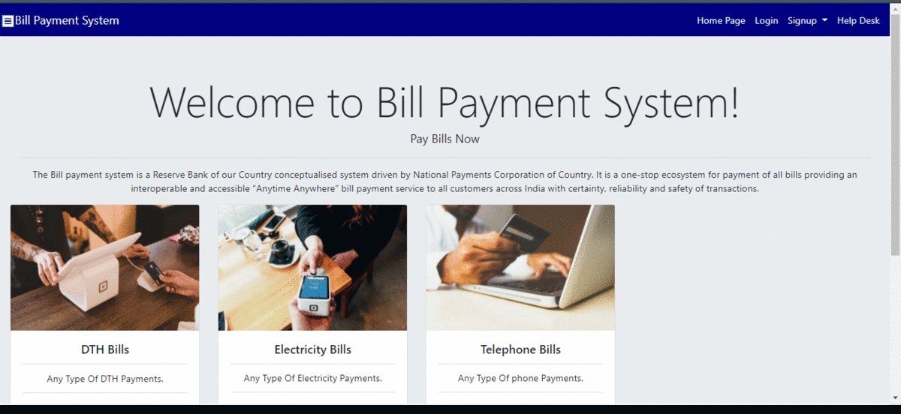

# Bill_payment_system-Micro-services => A Full Stack ( Java + Spring + Hibernate + SQL + Angular ) : 


## Ports and other details:

--> MySql is expected to run on 3306 port

--> Angular is expected to run on 4200 port 


````````````

## Steps to Execute

Step 0: Run the schema creation file in dbscript named as SQL Schema Details  =>  https://github.com/balajisomasale/Bill_payment_system-Micro-services/tree/master/Sql%20Schema%20and%20Data 

Step 1: Run the Eureka-Microservice => Port: 1003

Step 2: Run the authenticationbill-payment-service==> Port: 1001  => https://github.com/balajisomasale/Bill_payment_system-Micro-services/tree/master/authentication-bill-payment

Step 3: Run the bill-payment-system-service => Port: 1002 => https://github.com/balajisomasale/Bill_payment_system-Micro-services/tree/master/bill-payment-system-service

Step 4: Run the Zuul-gateway-truyum >Port: 1004  => https://github.com/balajisomasale/Bill_payment_system-Micro-services/tree/master/zuul-gateway-truyum


````

.png)


## The Final Updated Project is named as Third-change <br>
Angular part :: Access here :=> https://github.com/balajisomasale/Bill_payment_system-Micro-services/tree/master/third-change
Backend part :: follow the steps => 

## Visual project workflow gif format :


Suggestion : Please run the Project// use "npm install" ... To get the node_modules.. Due to Size Constraint, It was excluded.
This project was generated with [Angular CLI](https://github.com/angular/angular-cli) version 8.3.3.

## Development server

Run `ng serve` for a dev server. Navigate to `http://localhost:4200/`. The app will automatically reload if you change any of the source files.

## Code scaffolding

Run `ng generate component component-name` to generate a new component. You can also use `ng generate directive|pipe|service|class|guard|interface|enum|module`.

## Build

Run `ng build` to build the project. The build artifacts will be stored in the `dist/` directory. Use the `--prod` flag for a production build.

## Running unit tests

Run `ng test` to execute the unit tests via [Karma](https://karma-runner.github.io).

## Running end-to-end tests

Run `ng e2e` to execute the end-to-end tests via [Protractor](http://www.protractortest.org/).

## Further help

To get more help on the Angular CLI use `ng help` or go check out the [Angular CLI README](https://github.com/angular/angular-cli/blob/master/README.md).
